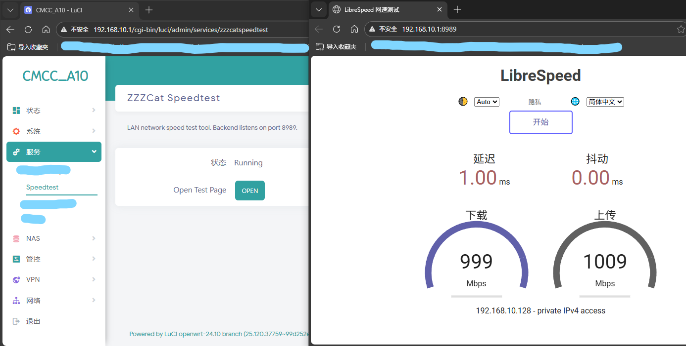

# luci-app-zzzcatspeedtest

LuCI wrapper for the bundled arm64 speedtest backend. Targets OpenWrt 24.10.

Only use high-performance devices for best results that can accurately reflect your actual network speed.



## Build (OpenWrt 21.02+)

```sh
# from your OpenWrt SDK / buildroot
./scripts/feeds update luci packages
./scripts/feeds install luci-base luci-compat # only if your tree still needs compat
make package/luci-app-zzzcatspeedtest/{clean,prepare,compile} V=s
```

## Install

```sh
# copy the generated ipk files to the router, then
opkg install zzzcatspeedtest_*.ipk luci-app-zzzcatspeedtest_*.ipk
```

After installation, open LuCI → Services → ZZZCat Speedtest. Click **Start** to launch the backend, then **Open test page** to load the embedded UI (defaults to <http://router.lan:8989>).

## Notes

- Backend binary is prebuilt for arm64 (`ONLY_FOR_ARCHS:=aarch64`), so it must match your target.
- Settings are written to `/usr/share/zzzcatspeedtest/settings.toml` on start; the database defaults to `/var/lib/zzzcatspeedtest/speedtest.db`.
- Autostart uses the init script: `service zzzcatspeedtest enable` / `disable`.

The binary is built from <https://github.com/librespeed/speedtest-go>
